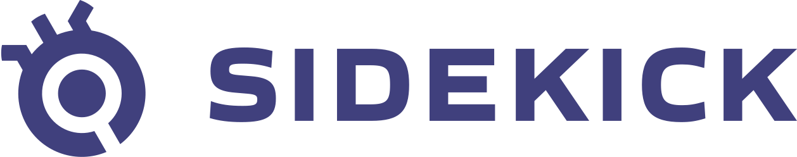

<div id="top"></div>


<!-- PROJECT SHIELDS -->

<!-- PROJECT LOGO -->
<br />
<div align="center">
  <a href="https://www.runsidekick.com">
    
  </a>


  <h3 align="center">Sidekick Node.js client</h3>

  <p align="center">
    Node.js client for Sidekick. Send your Sidekick logs and traces to any target in seconds!
    <br />
    <a href="https://docs.runsidekick.com/"><strong>Explore the docs »</strong></a>
    <br />
    <br />
    <a href="https://www.runsidekick.com">Sidekick Home</a>
    ·
    <a href="https://www.runsidekick.com/contact-us">Report Bug & Request Feature</a>
  </p>
</div>


<!-- TABLE OF CONTENTS -->
<details>
  <summary>Table of Contents</summary>
  <ol>
    <li>
      <a href="#about-the-recipe">About</a>
      <ul>
        <li><a href="#built-with">Built With</a></li>
      </ul>
    </li>
    <li>
      <a href="#getting-started">Getting Started</a>
      <ul>
        <li><a href="#prerequisites">Prerequisites</a></li>
        <li><a href="#installation">Installation</a></li>
        <li><a href="#example-usage">Example Usage</a></li>
      </ul>
    </li>
    <li><a href="#roadmap">Roadmap</a></li>
    <li><a href="#contact">Contact</a></li>
  </ol>
</details>


<!-- ABOUT THE PROJECT -->
## About Sidekick

Sidekick is a production debugging and on-demand logging tool where you can debug your running applications while they keep on running. Sidekick provides the ability to add logs and put non-breaking breakpoints in your application code which captures the snapshot of the application state, the call stack, variables, etc.

Sidekick Actions:
* A tracepoint is basically a non-breaking remote breakpoint. In short, it takes a screenshot of the variables when the code hits that line.
* Logpoints open the way for dynamic logging to Sidekick users. Replacing traditional logging with dynamic logging has the potential to lower stage sizes, costs, and time for log searching while adding the ability to add new logpoints without editing the source code, redeploying or restarting the application
## Client Features

* Sidekick Node Client opens up a new & headless way to use Sidekick. It allows you to both use custom ingest functions for the tracepoint/logpoint events and put/edit/delete your tracepoints/logpoints easily using code.


<p align="right">(<a href="#top">back to top</a>)</p>


### Built With

* [ws](https://github.com/websockets/ws)
* [axios](https://github.com/axios/axios)

<p align="right">(<a href="#top">back to top</a>)</p>


### Prerequisites

Tested with node v16.14.2
* npm
  ```sh
  npm install npm@latest -g
  ```


<!-- GETTING STARTED -->
# Getting Started


## Installation

1. Install sidekick-client
   ```sh 
   $ npm i @runsidekick/sidekick-client
   ```

## Example usage


###  Put tracepoint on a line
  1. Import `SidekickApi`  
      ```js
        const { SidekickApi} = require('@runsidekick/sidekick-client')
      ```

  2. Create an instance from Sidekick Api
      ```js
        const apiClient = new SidekickApi({apiKey:<Your Api Key>, apiToken:<Your Account Token>});

      ```
  3. Create a parameter that contains your file information to put tracepoint.
      ```js  
        const params= {
            applicationFilters: [
                {
                  name: "Demo application",
                  version: "v1.0",
                  stage: "prod"
                }
              ],
            fileName: "gitlab.com/repos/...",
            lineNo: 23,
            expireSecs: -1,
            expireCount: -1,
            enableTracing: true,
            persist: true
      }

      ```
  4. Call `putTracepoint` function
      ```js
        apiClient.putTracepoints(params);
      ```

  Then your tracepoint will be added to `line 23` in the given file. Also, you can use `SidekickApi` for any other operations such as removing tracepoint or putting log point.

<br>


### Use custom ingest function for the tracepoint/logpoint events


1. Create a `config.json` according to your needs
   ```js
    "SIDEKICK_TRACEPOINT_INDEX": "sidekick_tracepoint",
    "SIDEKICK_LOGPOINT_INDEX": "sidekick_logpoint",
    "SIDEKICK_EMAIL": "<Email of your sidekick account>",
    "SIDEKICK_PASSWORD": "<Password of your sidekick account>",
   ```


2. Import `onTrigger` from `@runsidekick/sidekick-client`
    
    ```js
        const { onTrigger } = require('@runsidekick/sidekick-client')
    ```
3. Create an `ingest` function that will send collected data to desired target:
    ```js
        function ingestFunc (index) {
            return async function (data) {
                console.log(JSON.stringify({index,data}));
            }
        }
    ```

4. Initialize Sidekick client info with proper parameters.
    
    ```js
        const clientInfo = {
            sidekickEmail : config['SIDEKICK_EMAIL'], 
            sidekickPassword : config['SIDEKICK_PASSWORD'], 
            tracepointFunction : ingestFunc(config['SIDEKICK_TRACEPOINT_INDEX']),
            logpointFunction : ingestFunc(config['SIDEKICK_LOGPOINT_INDEX'])
        }

        onTrigger(clientInfo);
     ```

Then your tracepoint events will be logged. You can customize the `ingest` function as you want.


<br>

  If you have an on-premise setup add the fields below to client object (Optional):

   ```js
    "sidekickHost": "ws://127.0.0.1",
    "sidekickPort": "7777"
   ```

  If have your user token you can use it instead of email & password (Optional):

   ```js
    "sidekickToken": "<>"
   ```


 

<p align="right">(<a href="#top">back to top</a>)</p>


<!-- ROADMAP -->
## Roadmap

- [x] Add websocket support
- [x] Custom ingest function
- [x] Add support for programattically putting logpoints & tracepoints using REST API


<p align="right">(<a href="#top">back to top</a>)</p>


<!-- CONTACT -->
## Contact

Barış Kaya - [@boroskoyo](https://twitter.com/boroskoyo)

Sidekick: [website](https://www.runsidekick.com)

## Special Thanks
Emin Bilgiç - [linkedin](https://www.linkedin.com/in/eminbilgic/)

<p align="right">(<a href="#top">back to top</a>)</p>
